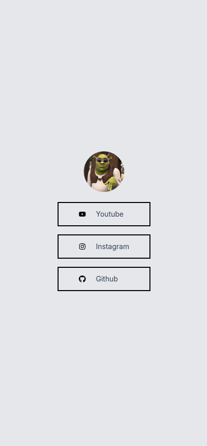

# Simple Linktree Clone

A simple clone of the Linktree application that allows users to create a single page with links to their various social media profiles and other important links.

- [Features](#features)
- [Technologies Used](#technologies-used)
- [Installation](#installation)
- [Usage](#usage)
- [Folder Structure](#folder-structure)
- [Images](#images)
- [License](#license)


## Features

- Add multiple links with titles and URLs
- Customize the appearance of the link page
- Responsive design for mobile and desktop

## Technologies Used

- React
- Tailwind CSS
- Supabase
- React Icons

## Installation

1. Clone the repository:
    ```sh
    https://github.com/mccartheney/simple-linktree-clone
    ```
2. Navigate to the project directory:
    ```sh
    cd simple-linktree-clone
    ```
3. Install the dependencies:
    ```sh
    npm install
    ```

## Usage

1. Create a `.env` file in the root directory and add your Supabase project URL and key:
    ```env
    REACT_APP_projectUrl=your_supabase_project_url
    REACT_APP_supabaseKey=your_supabase_key
    ```
2. Start the development server:
    ```sh
    npm start
    ```
3. Open your browser and navigate to `http://localhost:3000`

## Folder Structure

```
simple-linktree-clone/
├── .env
├── .gitignore
├── package.json
├── postcss.config.js
├── public/
│   ├── index.html
│   ├── manifest.json
│   └── robots.txt
├── README.md
├── src/
│   ├── App.jsx
│   ├── components/
│   │   └── icon/
│   │       └── IconComponent.jsx
│   ├── index.css
│   ├── index.js
│   └── media/
│       └── userProfileImage/
├── tailwind.config.js
```

## Images

Here are the screenshot of the project:



## License

This project is licensed under the MIT License. See the [LICENSE](LICENSE) file for details.
